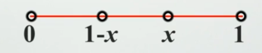

# 生成函数

对于序列$C_0,...$构造一个函数
$$
G(x) = C_0+C_1x+C_2x^2+...
$$
称$G(x)$为序列$C_0,C_1,...,C_2$的母函数

- 母函数的关键在于多项式的系数（序列）和x的次数，而不在于x本身
- 形式为幂级数

例：投掷m次骰子，和为n（n$\ge m$）的情况一共有多少种

解：构造母函数$G(x)=\sum_{i=1}^{6}x^i$其中，i表示点数，x的系数表示构成点数为i的所有可能种数，$G(x)$表示该骰子投掷一次，所以问题转化为求$\prod_{i=1}^{m}G(x)$中$x^n$的系数问题

## 整数拆分问题

例：现在1g，2g，3g，4g的砝码各一个，问从这些砝码中任选几个能称出几种重量？对于每一个重量，有几种组合的方法？

解：每一个砝码都有选或者不选两种状态，所以构造母函数

$G(x) = (1+x)(1+x^2)(1+x^3)(1+x^4)=1+x+x^2+2x^3+2x^4+2x^6+2x^7+x^8+x^9+x^{10}$

所以，一共能称出11种重量的砝码，系数就是每一个重量的组合方法

将上例的砝码改为1，2，4，8，16，32g的砝码各一个，能够称出多少重量，每个重量有几种称法？

解：类似的，我们去构造他的母函数
$$
\begin{aligned}
G(x) =& (1+x)(1+x^2)(1+x^4)(1+x^8)(1+x^{16} )(1+x^{32})\\
	 =& \frac{1-x^2}{1-x}\frac{1-x^4}{1-x^2}\dots \frac{1-x^{64}}{1-x^{32}}\\
	 =&\frac{1-x^{64}}{1-x}\\
	 =&1+x+x^2+\dots+x^{63}
\end{aligned}
$$

所以，能称出64种重量，而且每一种重量的取法只有一种

P.S. 任意一个整数都能拆成若干个二进制数相加的形式，使用二进制对整数进行拆分能够得到最少的拆分因子。

例：将整数n拆分成1，2，...，m的和，并允许重复，求其母函数
$$
\begin{aligned}
G(x)=& (1+x+x^2+\dots)(1+x^2+\dots)\dots(1+x^m+\dots)\\
	\overset{级数展开逆用}=&\frac{1}{1-x}\frac{1}{1-x^2}\dots \frac{1}{1-x^m}\\
	=&\frac{1}{(1-x)(1-x^2)\dots(1-x^m)}
\end{aligned}
$$
**无序拆分数**：将一个正整数n拆分成若干正整数的和，数字之间顺序无关并且允许重复，其不同的拆分数即p(n)

整数拆分p(n)的母函数为
$$
G(x) = (1+x+\dots)(1+x^2+x^4+\dots)(1+x^m+\dots)\dots
$$

## Ferrers图像

对于整数拆分的拆分方式，可以用一个图形来直观的表示，称该图像为Ferrers图像

对于整数n的Ferrers图像

- 有n个格子

- 上一层的格子数目比下一层的格子多或者相等

- 每一层至少一个格子

- Ferrers的**转置图像（行列互换）**仍然是一个Ferrers图像，称转置之后的图像和原来的图像是**共轭的**
- 每一行所有的格子的个数k代表了k参与了这个数的拆分
- 行数k代表了n能被拆分成k个数

**命题**：整数n拆分成最大数为k的拆分和数n拆分成k个数的拆分是相等的

证明：将Ferrers图像进行转置即可证明

**命题**：整数n拆分最多不超过m个数的和的拆分数和整数n拆分称最大不超过m的拆分数相等

证明：同理

**命题**：整数n拆分成互不相同的若干奇数的和的拆分数和n拆分成**自共轭（转置之后为本身）**的Ferrers图像的拆分数相等

证明：由于第i行第i列所有的格子的个数之和为奇数（重复只算一次），而Ferrers图像此时又是自共轭的，所以**每一个奇数拆分就对应了一个自共轭的Ferrers图像**

##  母函数解决递推问题

Hanoi塔问题是我们熟悉的问题，其递推公式是$h(n)=2h(n-1)+1,h(1)=1$，h(n)表示移动n个盘子所需的移动次数，现在我们通过构造母函数的方式解决这个问题
$$
\begin{aligned}
H(x)=& h(1)x+h(2)x^2+\dots h(n)x^n+\dots\\
H(x)-2xH(x)=& h(1)x+(h(2)-2h(1))x^2+\dots+\dots\\
=&x+x^2+\dots+x^n+\dots\\
(1-2x)H(x)=&\frac{x}{1-x}\\
H(x)=&\frac{x}{(1-x)(1-2x)}\\
=&\sum_{k=1}^{\infty}h(k)x^k\\
\overset{用高数学的分式拆分}=& \frac{1}{1-2x}-\frac{1}{1-x}\\
\overset{幂级数}=&\sum_{k=1}^{\infty}(2^k-1)x^k
\end{aligned}
$$
所以$h(k)=2^k-1$

数位问题

例：n位10进制数中（从0到n位）5的个数为偶数的数的个数

解：分类讨论（通过分类讨论来缩小问题规模的方法是常用的），讨论最后一位是不是5，如果最后一位是5，那么前n-1位有奇数个5，如果最后一位不是5，前n-1位有偶数个5，用an、bn分别表示前n位中奇数个5和偶数个5的数的个数，那么
$$
a_n = b_{n-1}+9a_{n-1}\\
b_n = a_{n-1}+9b_{n-1}\\
a_1 = 1,b_1=8
$$
下面用母函数的方法解决这个问题
$$
\begin{aligned}
A(x) = &a_1x + a_2x^2+\dots +a_nx^n+\dots\\
B(x) = &b_1x + b_2x^2+\dots +b_nx^n+\dots\\
A(x)-9xA(x)=&a_1x + (a_2-9a_1)x^2 + \dots +\\
=&a_1x + b_1x^2 +\dots +\dots\\
(1-9x)A(x)=&a_1x + xB(x) (发现有更好的定义方法A'(x)=A(x)/x)\\
(1-9x)A'(x)=&1 + xB'(x)
同理得到(1-9x)B'(x)-xA'(x)=8\\
\end{aligned}
$$

$$
\begin{cases}
(1-9x)A'(x)-xB'(x)=1 \\
(1-9x)B'(x)-xA'(x)=8\\
\end{cases}
$$

通过线性代数的方法解这个方程
$$
D=\begin{vmatrix}
1-9x & -x\\
-x&1-9x\\
\end{vmatrix}= (1-9x)^2-x^2 = (1-8x)(1-10x)
\\D_1 = \begin{vmatrix} 1 & -x\\ 8 &1-9x\end{vmatrix} = 1-x\\
A'(x)= \frac{D_1}{D} = \frac{1-x}{(1-8x)(1-10x)}(克莱姆法则)\\
同理:B'(x)=\frac{-71x + 8}{(1-10x)(1-8x)}
$$
通过待定系数的方法分解因式
$$
1-x = a(1-8x)+b(1-10x) = a+b+(-8a-10b)x = 1-x \Rightarrow a= \frac{9}{2},b=-\frac{7}{2}
$$
通过级数展开求系数
$$
A'(x) = \frac{\frac{9}{2} (1-8x)-\frac{7}{2}(1-10x)}{(1-10x)(1-8x)} = \frac{9}{2}\frac{1}{1-10x}-\frac{7}{2}\frac{1}{1-8x} = \sum_{i=0}^{\infty} (\frac{9}{2}10^i -\frac{7}{2} 8^i)x^i
$$
所以
$$
a_n = \frac{9}{2}10^{n-1} -\frac{7}{2}8^{n-1}
$$
bn同理

另解：由于an和bn的和是确定的，所以，可以将原式中的bn消掉

斐波那契

利用母函数的方法求斐波那契数列的通项公式
$$
\begin{aligned}
G(x) =& F_1x +\dots+F_nx^n+\dots\\
xG(x)=& F_1x^2+\dots +F_{n-1}x^n+\dots\\
(1+x)G(x) =& F_1x + F_3x^2+\dots+\dots\\
=&(G(x)/x-F_2x-F_1+F_1x)
\end{aligned}
\Rightarrow F_1x = G(x)(1-x-x^2)=x\Rightarrow G(x) = \frac{x}{1-x-x^2}
$$

$$
\begin{aligned}
\frac{x}{1-x-x^2} =& -\frac{x}{(1-\frac{1-\sqrt 5}{2}x)(1-\frac{\sqrt 5 +1}{2}x)}\\
=& \frac{1}{\sqrt 5}[\frac{1}{1-\frac{1+\sqrt 5}{2}x}-\frac{1}{1-\frac{1-\sqrt 5}{2}x}]\\
=&\frac{1}{\sqrt 5}\sum_{i=0}^{\infty}((\frac{1+\sqrt 5}{2})^i-(\frac{1-\sqrt 5}{2})^i)x^i\\
\end{aligned}
$$

$$
F_n = \frac{1}{\sqrt 5}((\frac{1+\sqrt 5}{2})^n-(\frac{1-\sqrt 5}{2})^n)
$$

# 递推关系计数

## 递推关系计数法

- 斐波那契数列
  - 有一个小孩要爬上有n个台阶的楼梯，他一步可以爬一个或者两个台阶。这个小孩爬上这n个台阶的不同方案数记作$a_n$，求$a_n$

    不失一般性的考虑第n阶楼梯的走法，可能是从第n-1或者第n-2阶楼梯走上来的

    $a_n = a_{n-1} + a_{n-2}$

  - 一对刚出生的兔子，每对兔子出生两个月之后才能开始繁殖后代，在出生两个月之后每对兔子每个月都将繁殖一对新的兔子

    考虑第n年的所有兔子的来源，其中一部分是第n-1年的所有兔子，其中一部分是新繁殖的，新繁殖的兔子数量恰好是第n-2年所有的兔子 数量（这里挺别扭）

    $a_n = a_{n-1} + a_{n-2}$

  斐波那契恒等式
  $$
  F_1^2 +\dots+F_n^2 = F_nF_{n+1}\\
  F_1+\dots+F_n = F_{n+2}-1\\
  F_{n-1}F_{n+1}-F_n^2 = (-1)^n
  $$
  两个式子都能使用累加法证明
  
  斐波那契优选法
  
  对于单峰函数，若$x\in (a,b),a<c<d<b$，如果$f(c) > f(d)$那么$a<x<d$，（删除d向右到b的范围），如果$f(c) < f(d)$那么$x\in (c,b)$，将c左边删除，这样的话，我们就要在下一次测试的过程中再取两个点，再计算两个值，（这样的话就造成了上一次取到的c或d点的浪费）斐波那契优选法可以让我们少选一个点，即复用上一次选到的c或者d点。
  
  
  
  第一次取两个点（按照比例，所以区间是0-1），x和1-x，假设舍去了x-1部分，那么下一次取的点为$x^2$和$(1-x)x$（按比例缩小），若利用上一次取到的点1-x，那么$x^2 = 1-x$，得到$x=\frac{\sqrt 5 - 1}{2}$，约为斐波那契数列相邻两项的比值，剩下的另一个点就是$x^3$(即$x(1-x)$)，这样就可以取一个点就能做到。
  
  我们用斐波那契数列中的项来代替x，以避免浮点精度的误差问题
  
  假设一共有$F_n$个点，那么选两个点$F_{n-1},F_{n-2}$，舍去一部分点
  
  - 假设舍去的是左边的，剩下的区间为$(F_{n-2},F_n)$，这个区间共有$F_n-F_{n-2}=F_{n-1}$个点，那么下一次选的两个点分别为这个区间的第$F_{n-2}、F_{n-3}$个点，即$F_{n-2}+F_{n-2} = 2F_{n-2},F_{n-2}+F_{n-3}=F_{n-1}$，所以对应的原来的位置为$F_{n-1},2F_{n-2}$这两个点
  - 如果舍去的是右侧，剩下的是$(0,F_{n-1})$，继续取两个点分别为$F_{n-2},F_{n-3}$

- 汉诺塔问题

  要将盘n个子全部移走，需要先将上面的n-1个盘子全部移走，再将最后一个盘子移动到目标柱上，再将上面的n-1个盘子移动回来

  $a_n = 2a_{n-1} + 1$

- 平面分割问题

  平面上有n条两两相交的直线，没有任何三个直线相交于一点，问共有多少个不同的交点

  假设在已经有的n-1条直线上再新增一条直线，新增加的那条直线和前n-1条直线都有交点

  $a_n = a_{n-1} + n-1$

## 递推关系的求解

对于类似斐波那契数列$F_n-F_{n-1}-F_{n-2} = 0$和汉诺塔$h_{n}-3h_{n-1}+2h_{n-2}=0$这样的地推关系，称这样的递推关系为线性常系数齐次递推关系

**定义**：如果$a_n$满足

- $a_n+c_1a_{n-1}+...+c_ka_{n-k}=0$
- $a_0=d_0,a_1 = d_1\dots a_{k-1}=d_{k-1}$
- $c_i,d_i$都是常数

称$\set{a_n}$为k阶线性常系数齐次递推关系

- 注意没有常数项和相邻两项相乘

用母函数法
$$
\begin{flalign}
&G(x) = a_0+a_1x + a_2x^2+\dots + a_nx^n+\dots\\
&a_n +c_1a_{n-1}+c_2a_{n-2}+\dots+c_ka_{n-k}=0\\
&x^k(a_k+c_1a_{k-1}...c_ka_0)=0\\
&x^{k+1}(a_{k+1}+c_1a_k...c_ka_1)=0\\
&x^{k+2}(a_{k+2}+c_1a_{k+1}...c_ka_2)=0\\
&...\\
&x^n(a_n+...c_ka_{n-k})=0\\
\end{flalign}
$$
相加，可以得到
$$
G(x)-\sum_{i=0}^{k-1}a_ix^i + c_1x(G(x)-\sum_{i=0}^{k-2}a_ix^i)+c_2x^2(G(x)-\sum_{i=0}^{k-3}a^ix^i)+\dots+c_kx^kG(x)=0\\
G(x)(1+c_1x+\dots c_kx^k)= \sum_{j=0}^{k-1}c_jx^j\sum_{i=0}^{k-1-j}a_ix^i\\
令P(x)= 右侧\\
G(x) = \frac{P(x)}{1+c_1x+...+c_kx^k}\\
G(x) = \frac{P(x)}{x^k(m^{k}+\dots+c_k)}\\
G(x) =  \frac{P(x)}{(m-a_1)^{k_1}+\dots+(m-a_i)^{k_i}}\\
G(x) =\frac{P(x)}{(1-a_1x)^{k_1}(1-a_2x)^{k_2}...(1-a_ix)^{k_i}}\\
$$
你就发现，递推关系和m的多项式是一一对应的，即特征根方法

### 特征根方程

对于无重根的情况
$$
a_n=\sum_{i=0}^{m}c_ix_i^n
$$
例：
$$
a_n = 5a_{n-1} - 6 a_{n-2} ,a_0=4,a_1 = 9\\
\begin{aligned}
x^2 &= 5x-6 &\Rightarrow x_1  =2 , x_2 = 3\\
a_n &= c_12^n + c_23^n\\
\end{aligned}
$$

对于k重根的情况
$$
a_n = (c_0+c_1n+...+c_{k-1}n^{k-1})x^n
$$
例：
$$
a_n-4a_{n-1}+4a_{n-2}=0,a_0=1,a_1=4\\
(x-2)^2=0\\
a_n=(c_0+c_1x)2^n
$$
对于共轭复根的情况

对于一个特征方程，他的两个复根是
$$
z_1=a+bi,z_2=a-bi\\写成三角形式\\
z_1= \rho(\cos \theta +i\sin \theta )\\
z_2= \rho(\cos \theta -i\sin \theta )\\
a_n = c_1 \rho^n\cos n\theta + c_2 \rho^n\sin n\theta
$$
特征方程和一阶线性齐次微分方程的解的形式很类似

例：等差数列求和
$$
s_n = \sum_{k=0}^nk\\
s_n = 1+\dots+n\\
s_{n-1}=1+\dots+n-1\\
相减\\
s_n-s_{n-1} = n\\
s_{n-1}-s_{n-2}=n-1\\
相减\\
s_n-2s_{n-1}+s_{n-2}=1\\
s_{n-1}-2s_{n-2}+s_{n-3}=1\\
相减\\
s_n-3s_{n-1}+3s_{n-2}-s_{n-3}=0\\
至此构建出了齐次方程\\
x^3-3x^2+3x-1=0\\
x^3-1 -3x(x-1)=0\\
(x-1)(x^2-2x+1)=0\\
(x-1)^3 = 0\\
s_0=0,s_1=1,s_2=3\\
s_n=(c_0+c_1n+c_2n^2)1^n\\
代入求解得到
s_n =1/2(n+1)n
$$

$$
s_n=\sum_{k=0}^{n}k^2
\\
s_n = 1+\dots +n^2\\
s_{n-1} = 1+\dots+(n-1)^2
相减\\
s_n-s_{n-1} = n^2\\
s_{n-1}-s_{n-2}=(n-1)^2相减\\
s_{n}-2s_{n-1}+s_{n-2} = 2n-1\\
s_{n-1}-2s_{n-2}+s_{n-3}=2n-3相减\\
s_{n}-3s_{n-1}+3s_{n-2}-s_{n-3}=2\\
s_{n-1}-3s_{n-2}+3s_{n-3}-s_{n-4}=2相减\\
s_n-4s_{n-1}+6s_{n-2}-4s_{n-3}+s_{n-4}=0\\
x^4-4x^3+6x^2-4x+1=0\\
(r-1)^4=0
...
$$

例：将一个圆分成n份，圆心是他们的公共顶点，相邻的两份颜色不同，共有k种颜色，问有多少种染色方案？

分析：设$a_n$表示分成n份共有的方案数，假设第n块区域相邻的两块区域颜色相同，那么一共有k-1种染色的方法，将第n个区域第一个区域第n-1个区域看成一个区域，相当于给这n-2个区域着色，所以，这种情况下，总共的方案数为$(k-1)a_{n-2}$，如果第1个和第n-1个区域颜色不相同，那么第n个区域有k-2种颜色可以选择，剩下的相当于n-1个区域的涂色问题即$(k-2)a_{n-1}$，$a_2=k(k-1) k,a_3=k(k-1)(k-2)$
$$
a_n = (k-1)a_{n-2}+(k-2)a_{n-1}\\
a_0 = k , a_1 = 0\\
x^2 = (k-1)+(k-2)x\\
(x+1)(k-1-x)=0\\
x_1 = -1,x_2 = k-1\\
a_n = A(k-1)^n + B(-1)^n\\
...
$$

### 迭代法

$$
\begin{align}
h(n) =& h(n-1) + n-1\\
=&h(n-2) + n-2 + n-1\\
=&...+...\\
=&h(1) + (n-1)\cdot n- (1+2+..+n-1)\\
=&h(1) + \frac{(n-1)\cdot n}{2}
\end{align}
$$

